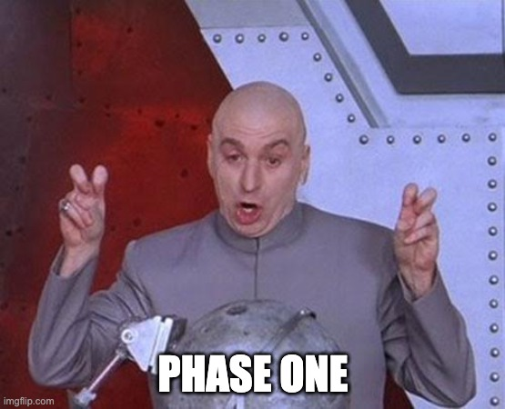

# Phase 1 - FastAPI Stock Market Application



## Overview

This project is a FastAPI application that retrieves the latest stock market prices from an external API (Twelve Data) and allows users to manage custom alert rules stored in a CockroachDB database. The application provides endpoints for creating, updating, deleting, and retrieving alert rules based on stock price thresholds.

## Instructions to Run the Code

### Prerequisites

1. **Docker**: Ensure you have Docker installed on your machine.

### Running the Application

1. **Build and Start the Application**: Use the provided Makefile to build and start the application.

   ```bash
   make up
   ```
   This command will build the Docker images and start the application along with the database.

2. **Access the Application**: Once the application is running, you can access it at `http://localhost:8000`. You can access the API documentation (Swagger UI) at `http://localhost:8000/docs`.

### Trade-offs Made

1. **Error Handling**: Basic error handling is implemented, but there is room for improvement.
2. **Async Support**: The application is not fully async. It is a simple FastAPI application that uses a synchronous API client to retrieve data from the Twelve Data API.
